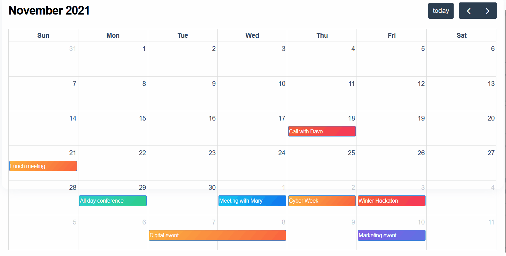

# Dash-Full-Calendar


[](https://github.com/ambv/black)


[](https://community.plotly.com/t/django-dash-token-authentication/82088)



`Dash-Full-Calendar` is a comprehensive resource aimed at enhancing the development of frontend design of a calendar based component in the Dash framework. 

## Features

- **large interactive calendar:** the event dates are draggable, auto populate based on js data. On click function to Trigger callbacks or modals.
- **Boilerplate Code:** Ready-to-use templates that can be easily integrated into your Dash projects.
- **Examples:** A variety of examples showcasing different Dash frontend components and their use cases.

## Getting Started

To get started with `dash-frontend`, clone this repository to your local machine:

```bash
git clone https://github.com/pip-install-python/dash-full-calendar.git
cd dash-fullcalendar
```
Ensure you have the following installed:

- Python (3.8.18 or later)
- pip
- Virtual environment (recommended)

### Installation
1. Create and activate a virtual environment:

Windows:
```
python -m venv venv
.\venv\Scripts\activate
```
macOS/Linux
```
python3 -m venv venv
source venv/bin/activate
```

2. Install the required packages:

```
pip install -r requirements.txt
```

### Running Examples
Navigate to the example you wish to run and execute the application:

```
cd examples/basic
python app.py
```
### Documentation
For more detailed information about dash-frontend and its components, visit our documentation page.

### Contributing
Contributions are what make the open-source community such an amazing place to learn, inspire, and create. Any contributions you make are greatly appreciated.

### License
Distributed under the MIT License.

### Contact
Pip Install Python

Project Link: https://github.com/pip-install-python/dash-frontend


